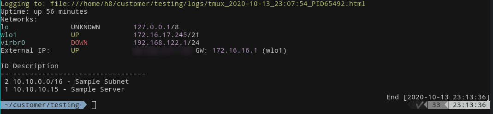
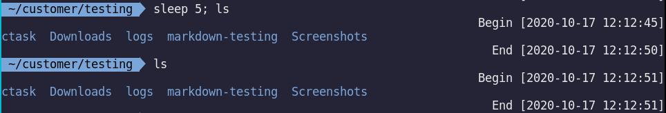
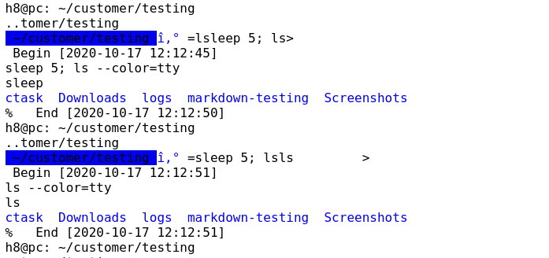
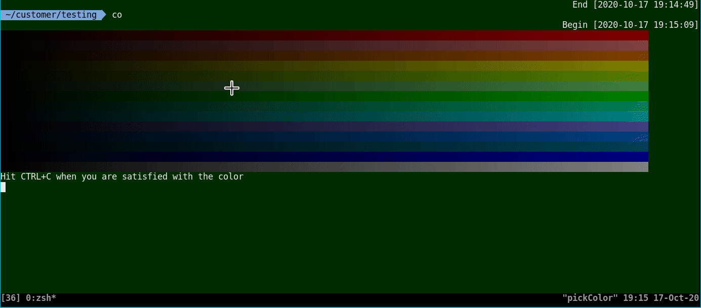
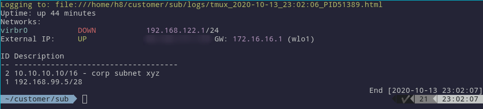
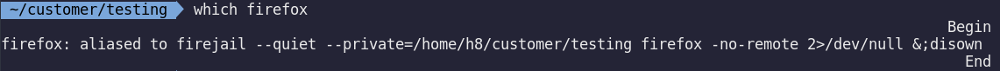
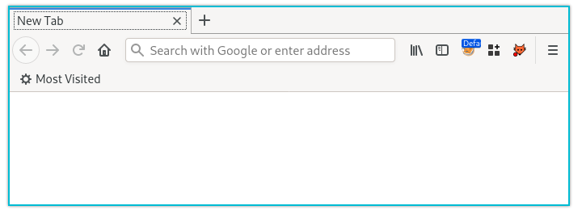

# cLoggy

## Description

**cLoggy** extends **zsh** with logging of all terminal input and output in zsh for each terminal and adds a lot of convenience features for better project and customer management.

* Each customer has its own pseudo home folder within `~/customer` (`cc` as `cd ~` equivalent)
* It adds the network centric message of the day, which shows the hosts IP, subnet, default gateway and external IP.
* There is a start and end timestamp that will be inserted before and after each command.
* Each customer will have a separate `taskwarrior` instance called **ctask**. With this alias you can manage per customer tasks while using **task** for global taskwarrior tasks.
* For each customer its own history can be created. While within a customer environment, all commands are written to `~/customer/[customer]/.history`. With `hist` you can search through all customer history files at once (similar to history).

Most features are opt-out. You can configure them in the configuration file `.oh-my-zsh/plugins/cLoggy/cLoggy-settings.conf`, which will be created on the first start with the plugin activated.

The customer folder structure looks like the following:

```
~/customer/
├── CustomerA/
	│ .history
	│ .markdown-CustomerA
    │ .mozilla
    │ ctask/
    │ ...
    │ logs/
    ├─── 2017-01-05_15:05:53.5600*.html
    └─── 2017-01-05_15:14:05.6680*.html
├── CustomerB
    | .history
    │ .markdown-CustomerB
    │ .mozilla
    │ ctask/
    │ ...
    │ logs/
    ├─── 2017-01-05_15:02:24.4641*.html
```

## Screenshots

Motd and taskwarrior integration:



Start and end time for each command:



HTML logging - work in progress (showing the rendered HTML code in Firefox generated by `ansifilter --html --font monospace`):



Change the background for your shell and for each of your customer (persistent):



## Requirements

* Any zsh framework, **oh-my-zsh** recommended
* task / Taskwarrior (for ctask)
* Firefox
* Firejail
* tmux
* grabc for color picking (X11) or grim, slurp imagemagick (Wayland)
* Typora or similar for note taking in Markdown

## Installation

1. `cd .oh-my-zsh/plugins`

2. `git clone https://github.com/H8to/cLoggy`

3. Add `cLoggy` as plugin into your `.zshrc` configuration file

   ```sh
   plugins=(... cLoggy ...)
   ```

4. Edit `.zshrc` config file to enable tmux

   ```sh
   # add near the top of your configuration
   if [ -n "$PS1" ] && [[ ! "$TERM" =~ screen ]] && [[ ! "$TERM" =~ tmux ]] && [ -z "$TMUX" ]; then
     TERM=screen-256color exec tmux
   fi
   ```

5. Execute `zsh`

6. Recommended: Enable incremental logging rather than waiting for the shell to exit. 

   `setopt INC_APPEND_HISTORY`

## Usage

**Switch to customer environments:**

```sh
sc CustomerA
# or
setCustomer CustomerA
```
The `setCustomer` command changes the current customer and uses the tmux pipe-pane functionality to write a logfile to `~/customer/[customer]/logs/`. If the user does not exist it will be created on the fly.
If `motd_enabled` is set cLoggy will show the currently active customer on each new terminal session in addition to the network information. 

**Leave any customer environment:**

```sh
sc
# or
setCustomer
```
Just typing `setCustomer` without any arguments will quit the customer environment and disable the logging.

From any customer and the main environment use `tc` to set a temporary customer and `cback` to switch to the last persistent customer environment.

Use `co` or `loadColor` to change the current background color of a customer. cLoggy relies on `grabc` to get a color by clicking somewhere on the color selection bars within the terminal with your mouse. Alternatively you might script colors into the file `.bgcolor` in the hex format `#aabbcc`.

Delete customer folders with the command `delcu <customerY>.`

## Additional Features

Auto-completion works for `setCustomer` as it includes all folders found in `~/customer/` as auto-completion name.

### Taskwarrior

`c` or `ctask` is an alias for taskwarrior with the custom environment path `~/.ctask/[customer]` for separated taskwarrior task scheduling in customer mode. All tasks or, in my case customer subnet information, will be displayed below the motd.

The alias `a` will add a task. So I could use `a 10.10.10.10/16 - corp subnet xyz` and so on in order to create my subnet list for this customer.



### Firefox / Firejail

Within customer environments `firefox` gets aliased to firejail, which opens an instance of Firefox within the current customer folder. Before you test it, make sure to create a browser template with the command `fireEditTemplate`. I created my master browser with an empty history, pwnfox (with some RBAC testing containers), Foxyproxy and the Burp proxy preconfigured.

The alias will be updated if you change the customer:



The huge benefit you get with this, is that each customer will have a clean environment and your screenshots for e.g. penetration testing findings will not end up containing sensitive data from third parties. Also the risk of issuing unintended requests by misclicking (e.g. within the auto completion) is reduced to a minimum.



### Templating

If `$use_customer_templating` is set your configured template folder from `$customer_dir_template` is copied to each new customer folder. In order to overwrite it again you can delete the file `<customer>/.template-marker `, which indicates that the template has already been copied.

### Permanent and Temporary Customer

There are two ways to switch into a customer environment.

* Permanent `setCustomer` or `sc`
* Temporary `tempCustomer` or `tc`

The first will write your selected customer into the file `~/.customer`. The latter does not write your selection into this file. If you start additional terminals they will read the currently active customer from the file.

### Global Per Folder History

If `$use_per_folder_history` is enabled all commands are saved to `$HOME/.zsh_history.d/$PWD/history` in addition to the usual history and customer history regardless which customer is active.

You can use `here` to show all commands that have been run in a certain folder. This is very useful if you git cloned a project months ago and ran some commands you have to look up. Just switch to the folder, run `here` and your command history for this folder will be displayed.

## Try it Yourself

```bash
dockershellhere () {
        dirname=${PWD##*/}
        sudo docker run --rm -it --entrypoint=/bin/bash -v `pwd`:/${dirname} -w /${dirname} "$@"
}
mkdir shelltest && cd shelltest
dockershellhere ubuntu
apt-get update
apt-get install vim curl zsh git tmux iproute2 taskwarrior grabc
sh -c "$(curl -fsSL https://raw.github.com/ohmyzsh/ohmyzsh/master/tools/install.sh)"
cd ~/.oh-my-zsh/plugins/
git clone https://github.com/H8to/cLoggy
sed -i "s/plugins=(git)/plugins=(git cLoggy)/g"  ~/.zshrc
zsh -c tmux
```

## Todo

- [ ] Fix the cmdline mess that sometimes happens in the logfile (e.g. `î‚° =sleep 5; lsls         >`)
- [ ] More docs (?) - Please tell me what needs further explanation
- [ ] Add some optional check script that looks if the needed packages are installed
- [x] Create a better autocompletion ~~and understand the zsh autocomplete functionality~~
- [x] Exclude *currentCustomer@* symlink from auto completion ~~(Need help here)~~

## Cheatsheet

### General

| Alias       | Command            | Description                                                  |
| ----------- | ------------------ | ------------------------------------------------------------ |
| **General** |                    |                                                              |
| sc          | setCustomer        | Permanent customer selection. This persists through the creation of new terminals |
| tc          | tempCustomer       | Temporary customer selection. This does only apply to the current zsh terminal. Starting a new terminal will load the last permanent customer from the `.customer` file in your home location. |
| delcu       | deleteCustomer     | Delete the specified customer (`delcu customerF`)            |
| cback       |                    | Switch back to the last permanent customer                   |
| cs          |                    | Clear the terminal screen and load the motd                  |
| cc          |                    | Switch to the customer home folder                           |
| cl          |                    | Add a comment to the currently active project into the `timeline.log`. This prepends the current date and time as well as your initials to the comment. |
| co          | pickColor          | Choose the background color for the current customer         |
| hist        | grep magic         | Search through all customer history files and output the search command (e.g. `hist ps`) |
| here        | path based history | This function does show the history file for the current folder. All history files are saved to `$HOME/.zsh_history.d/$PWD/history` regardless which customer is active. |

### Firejail

| Alias            | Command | Description                                                  |
| ---------------- | ------- | ------------------------------------------------------------ |
| firefox          |         | This command starts firefox in a firejail in order to have a unique firefox instance for each customer. |
| fireEditTemplate |         | Used to edit the template (add new certificates e.g.)        |

### Taskwarrior


| Alias | Command                 | Description                                                  |
| ----- | ----------------------- | ------------------------------------------------------------ |
| c     | ctask                   | Main taskwarrior command to interact with the customer instance |
| a     | ctask add               | Add a new item to ctask                                      |
| d     | ctask del               | Delete an item from ctask                                    |
| f     | ctask add "file://${@}" | Add a file link to ctask (clickable in most terminals)       |

### Typora

| Alias | Command                                              | Description                                                  |
| ----- | ---------------------------------------------------- | ------------------------------------------------------------ |
| note  | `typora $HOME/customer/$customer/markdown-$customer` | Open Typora in the currently active customer markdown project folder. |

